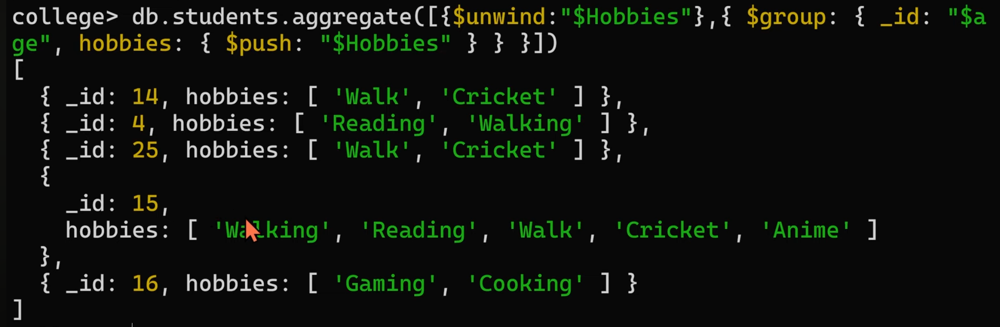
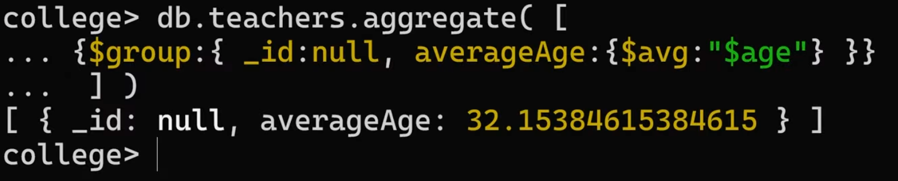
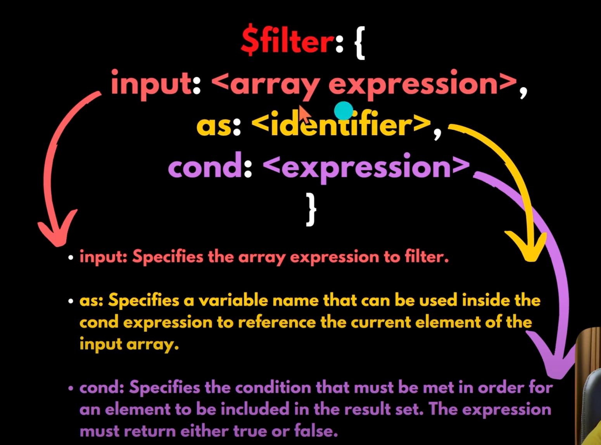
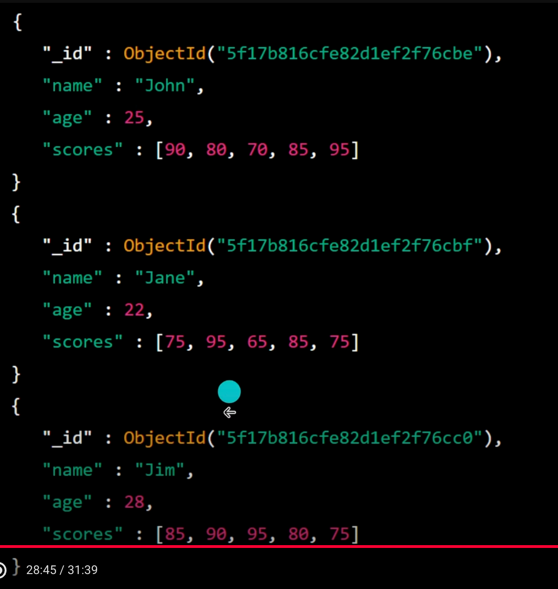

# What is Aggregation in MongoDB?

- Aggregation is a way to process documents in a collection and return computed results or (It groups the data from multiple documents into a single document based on the specified expression).
- Think of it like SQL’s GROUP BY + HAVING + aggregate functions (SUM, AVG, COUNT, etc.).
- MongoDB uses the aggregation pipeline: a sequence of stages that transform the documents.

- A query returns results → those results are passed into another query (next stage) → and so on.
- Each stage works on the output of the previous stage.
- So it’s like nested queries in SQL, but instead of writing multiple queries inside each other, MongoDB chains them in a pipeline.

## When to use Aggregation?

- Analytics (sum, avg, max, min, count).
- Data transformation.
- Reporting dashboards.
- Joining data across collections.

Syntax:
```
db.collection.aggregate(pipeline, options)
```


### 1. Find all teachers whose gender is male.
```
db.teachers.aggregate([{ $match: {gender: "male"}}])
```


### 2. Group teachers by age.
```
db.teachers.aggregate([{ $group: { _id: "$age"}}])
```


The `$group` operator groups documents by the age field, creating a new document for each unique age value.

The `_id` field in the group stage specifies the field based on which the documents will be grouped.

### 3. Group teachers by age and show all teachers names per age group.
```
db.teachers.aggregate([{ $group: { _id: "$age", names: { $push: "$name"}}}])
```


The names field uses the `$push` operator to add the name field from each document in the group to an array.

### 4. Group teachers by age and also show complete document per age group.
```
db.teachers.aggregate([{ $group: { _id: "$age", allData: { $push: "$$ROOT"}}}])
```


The `$$ROOT` value is a reference to the current document being processed in the pipeline, which represents the complete document.

### 5. Give a count per age of male teacher.
```
db.teachers.aggregate([{ $match: { gender: "male"}}, { $group: { _id: "$age", countOfTeachers: { $sum: 1 }}}])
```

The value of `$sum is 1` which means that for each document in the group, the value of `countOfTeachers` will be incremented by 1.


### 6. Give a count per age of male teachers and sort them by count in desc manner.
```
db.teachers.aggregate([{ $match: { gender: "male"}}, { $group: { _id: "$age", numOfTeachers: { $sum: 1 }}}, { $sort: {numOfTeachers: -1} }])
```


### 7. Get all the documents and put inside a single group.
```
db.teachers.aggregate([
    { $match: { gender: "male"}},
    { $group: { _id: "$age", numOfTeachers: { $sum: 1 }}},
    { $sort: {numOfTeachers: -1} },
    { $group: {_id: null, maxNumInAnAgeGrp: { $max: "$numOfTeachers" }}}
])
```


### 8. `$toDouble` operator
```
db.teachers.aggregate([
    { $group: {_id: "$age", sumOfAgeInEachAgeGrp: { $sum: {$toDouble: "$age" }}}}
])
```

### 9. Find Hobbies per age group.
```
db.students.aggregate([
    { $group: {_id: "$age", hobbies: { $push: "$Hobbies" }}}
])
```


It will return a single array not array of array. It create multiple documents according to hobbies.




### 10. Find number of students per each hobbies.
```
db.students.aggregate([
    { $unwind: "$Hobbies" },
    { $group: {_id: "$Hobbies", count: { $sum: 1 }}}
])
```


### 11. Find average age of all students.
```
db.teachers.aggregate([
    { $group: {_id: null, averageAge: { $avg: "$age" }}}
])
```



### 12. Find the total number of hobbies for all the students in a collection.
```
db.students.aggregate([
    { $unwind: "$Hobbies" },
    { $group: {_id: null, count: { $sum: 1 }}}
])
```


### 13. List all hobbies.


It will return hobbies list with duplicates values.


It will return hobbies list with unique values.


## `$filter` operator




### 1. Find the average of scores for students whose age is greater than 20.
```
db.students.aggregate([
    {
        $group: {
            _id: null,
            avgScore: {
                $avg: {
                    $filter: {
                        input: "$scores",
                        as: "score",
                        cond: { $gt: ["$age", 20] }
                    }
                }
            }
        }
    }
])
```
