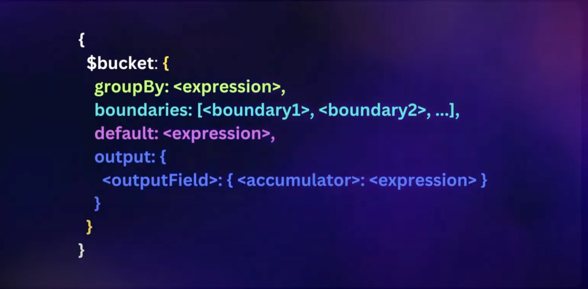
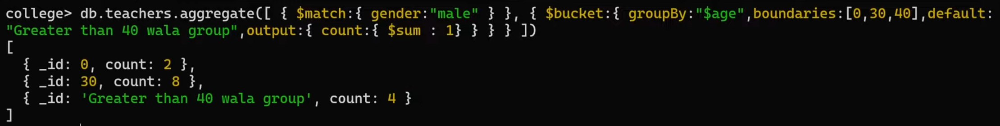
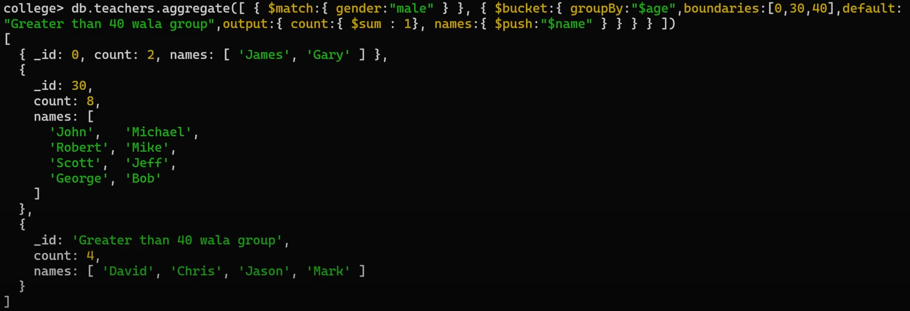

# `$bucket` operator

When you to categorize into discrete groups based on specified boundaries.

## 1. Categorize male teachers based on their ages into three buckets: (ages less than 30, ages between 30 and 40, and ages greater than 40)

```
db.teachers.aggregate([
    { $match: { gender: "male" } },
    { 
        $bucket: { 
            groupBy: "$age",
            boundaries: [0, 30, 40],
            default: "Greater than 40",
            output: {
                count: { $sum: 1 }
            }
        }
    }
])
```





