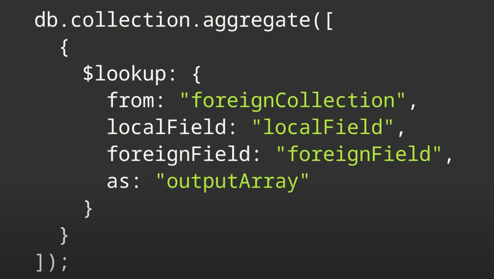
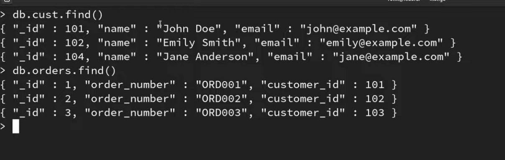
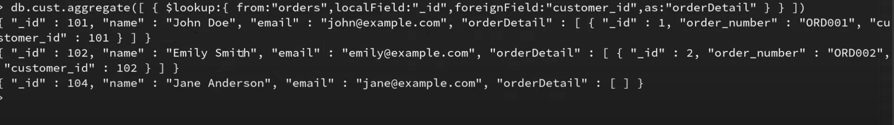

# `$lookup`

The `$lookup` is an aggregation pipeline stage that allows you to perform a left outer join between two collections.

Syntax:
```
db.collection.aggregate([
    {
        $lookup: {
            from: "foreignCollection",
            localField: "localField",
            foreignField: "foreignField",
            as: "outputArray"
        }
    }
])
```





```
db.customer.aggregate([
    {
        $lookup: {
            from: "orders",
            localField: "_id",
            foreignField: "customer_id",
            as: "orderDetails"
        }
    }
])
```


`Note`: The above example is based on a `left outer join`. To achieve a `right outer join`, you can apply the aggregation on the `orders` collection instead. For an `inner join`, you can add a condition to exclude documents with no matching data.

## How to Join Collections in MongoDB?

There are 4 type of Join in term of relational database:

1. Inner Join
2. Left Outer Join
3. Right Outer Join
4. Full Outer Join