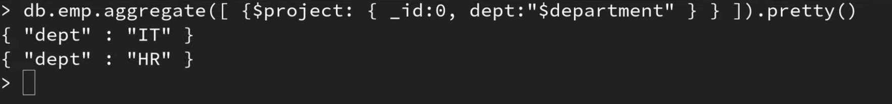

# `$project` stage

`$project` stage is used in the aggregation pipeline to reshape documents, include or exclude fields, and create computed fields.

It allows you to customize the output of your aggregation query by specifying which fields to include or exclude, applying expressions to existing fields, and renaming fields.

Syntax:
```
{
    $project: {
        // Field inclusion/exclusion or field transformations
    }
}
```


```
db.emp.aggregate([{
    $project: {
        firstName: 1,
        lastName: 1,
        _id: 0
    }
 }])
```


## Rename field name in return value not in DB
```
db.emp.aggregate([{
    $project: {
        _id: 0,
        dept: "$departname"
    }
 }])
```


## Find the sum of salary for 1 year
```
db.emp.aggregate([{
    $project: {
        _id: 0,
        firstName: 1,
        lastName: 1,
        monthlySalary: "$salary",
        annualSalary: { $multiply: [12, "$salary"] }
    }
 }])
```
