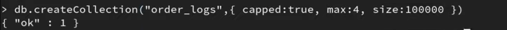
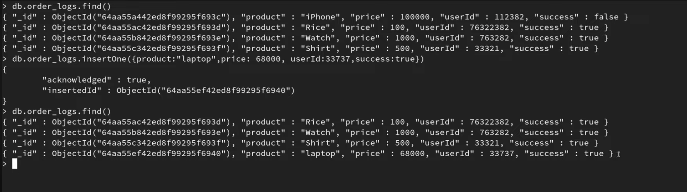

# Capped Collection in MongoDB

A Capped Collection in MongoDB is a fixed-size collection that:

- Stores documents in insertion order (like a circular queue).
- Automatically overwrites the oldest documents when it reaches its size limit.
- Maintains a high-performance insertion order.

👉 Think of it as a ring buffer or FIFO (First-In, First-Out) storage for MongoDB.

## In Short:

A Capped Collection is a fixed-size, high-performance collection in MongoDB that behaves like a circular queue, automatically replacing old documents with new ones.