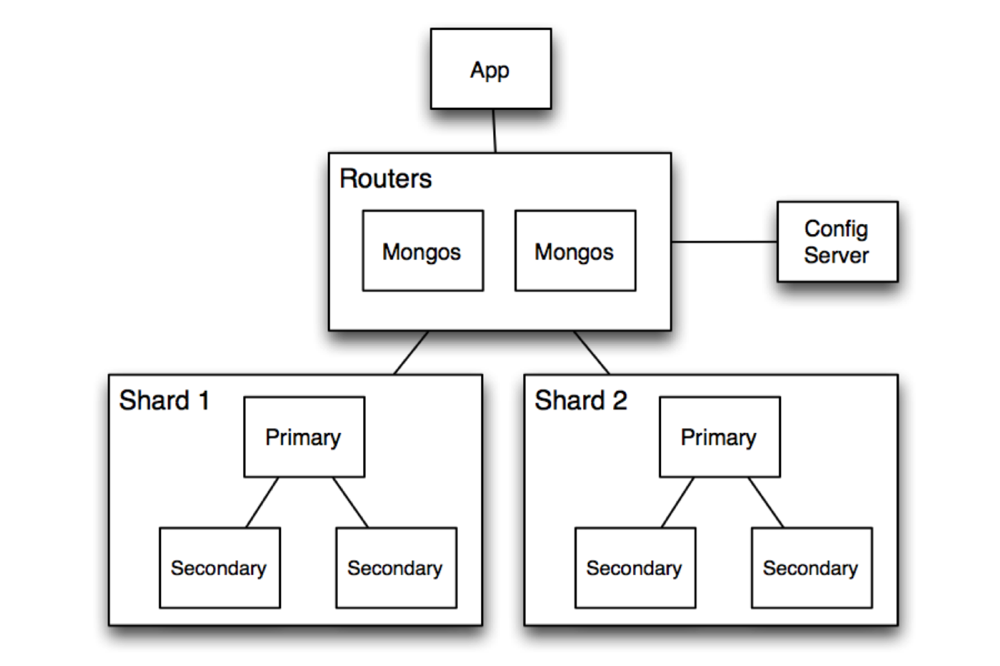

# Replication and Sharding

## Replication
Replication in MongoDB is the process of storing copies of the same data on multiple servers.


### Why we need Replication?

- Replication provides High (24*7) availability of data.
- Protection from single server loss, hardware failures and service interruptions.
- Ensure that data is always available to every client.

### Benefits of Replication

- `High Availability` – System continues even if one node fails.
- `Data Redundancy` – Copies of data are stored on multiple servers.
- `Read Scaling` – You can read from secondary nodes to balance load.
- `Disaster Recovery` – Data is safe even in hardware failure.

### What is Replica Set?
- MongoDB manages replication using replica sets, which are collections of related MongoDB nodes.
- A Replica Set requires a minimum of three MongoDB nodes.
- One of the nodes will be considered the primary node that receives all the write operations.
- The others are secondary nodes will replicate the data from the primary node.
- If failed node is recovered, works as a secondary node again.


### Commands for Replica Setup
```
rs.initiate()
rs.add("mongodb2.example.net")
rs.add("mongodb3.example.net")
rs.status()
```

## Sharding
Sharding is a data distribution process and stores a single data set into multiple databases.




Add more capacity to a single server, such as adding more memory and processing units or adding more RAM on the single server.


### Why do we need MongoDB Sharding?

`Without sharding`:

- All data is stored on a single server.
- As data grows → queries become slow, memory and storage overflow, and performance drops.

`With sharding`:

- Data is horizontally partitioned (split by data value).
- Each shard stores a portion of the total data.
- MongoDB can handle large-scale data and high query loads efficiently.


### How It Works (Step-by-Step)

- `Data is divided` into chunks based on a `shard key` (e.g., userId, region, etc.).
- Each `shard` stores a specific range of these chunks.
- The `mongos` router uses the config server to find where data lives.
- Queries are automatically routed to the `correct shard(s)`.


### Benefits of Sharding

| Benefit                      | Explanation                                   |
| ---------------------------- | --------------------------------------------- |
| ⚡ **Horizontal Scalability** | Add more shards (servers) as data grows.      |
| 🚀 **Improved Performance**  | Queries run faster since data is distributed. |
| 💾 **More Storage Capacity** | Combine multiple machines’ storage.           |
| 🔁 **Fault Tolerance**       | Each shard is usually a replica set.          |

### Shard Key Example
```
sh.enableSharding("shopDB")
sh.shardCollection("shopDB.orders", { userId: 1 })
```

## Sharding vs Replication
| Feature         | **Replication**                     | **Sharding**                          |
| --------------- | ----------------------------------- | ------------------------------------- |
| **Goal**        | Data availability & fault tolerance | Horizontal scaling for large data     |
| **Data copies** | Same data on all nodes              | Different parts of data on each node  |
| **Use case**    | High availability                   | High volume & high throughput systems |

## ✅ In short:

- `Sharding` = splitting data across multiple servers to scale horizontally.
- `Replication` = copying the same data across multiple servers for fault tolerance.