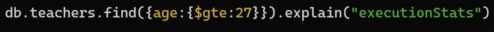
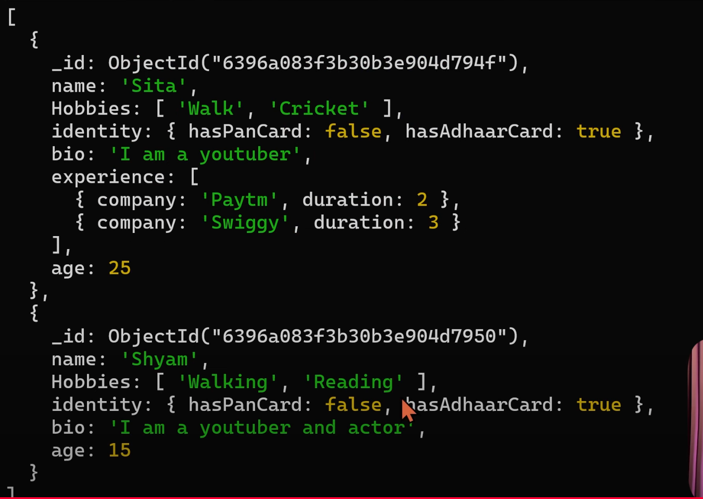

# 1. To check existing databases

```
show dbs
```


# 2. Create new database

```
use db_name
```

# 3. To create a collection inside database

```
db.students.insertOne({ name: "Ram", age: 12 })
```


# 4. To get all the documents from a collection inside database

```
db.students.find()
```


# 5. Update a document

```
db.students.updateOne({ name: "Ram" }, { $set: { idCards: { hasPanCard: false, hasAdhaarCard: true } }})
```


`Note 1: MongoDB supports a maximum of 100 levels of nesting for BSON documents.`

`Note 2: The maximum size for a single BSON document in MongoDB is 16 megabytes (MB).`

# 6. Update many document
```
db.students.updateMany({}, {$set: {hobbies: ['Anime', 'Cooking']}})
```


# 7. Search document from collection

```
db.students.find({ 'idCards.hasPanCard': true })
```


# 8. CRUD Operations


# 9. To check all the collections

```
show collections
```

# 10. Find vs FindOne


## find()
- Returns all documents that match the query criteria.
- Output is a cursor (like an iterator), not an array directly.

## findOne()
- Returns the first matching document only (not an array).
- If no document matches, it returns null.


## pre-defined keywords

```
lt -> less than
lte -> less than equal
gte -> greater than equal
```


# 11. What is a Cursor in MongoDB?

- In MongoDB, when you use find(), it doesn’t return all documents immediately.
- Instead, it gives you a cursor — a pointer/iterator to the result set of the query.
- You can then iterate through the cursor to access documents one by one.

## How it works:

1. You run a query:
```
const cursor = db.users.find({ age: 25 });
```
Here, cursor is not an array — it’s an object that points to matching documents.

2. You can loop over it:
```
cursor.forEach(doc => console.log(doc));
```

3. Or convert it into an array:
```
const result = db.users.find({ age: 25 }).toArray();
console.log(result);
```

## Behind the scenes:
- MongoDB doesn’t load all matching documents into memory at once (that could be huge!).
- Instead, the cursor fetches documents in batches (default 101 or 4MB, whichever comes first).
- As you iterate, it fetches the next batch until all documents are retrieved.

## Benefits of using Cursor:
- `Memory efficient` → doesn’t load millions of documents at once.
- `Lazy loading` → fetches only when needed.
- `Control` → you can use cursor methods like:

    - `.limit(n)` → limit number of results
    - `.skip(n)` → skip results
    - `.sort({...})` → sort results

👉 Example:
```
db.users.find({ age: { $gt: 20 } })
  .sort({ name: 1 })
  .limit(5)
  .forEach(doc => console.log(doc));
```

This will get users with age > 20, sorted by name, only first 5, using the cursor.

## ⚡ In short:
A cursor is like a smart pointer that lets you process query results efficiently without loading everything into memory at once.

# 12. Insert Document in Collection

## Insert a Document
```
db.students.insert({name: "Ram", age: 12})
```


```
db.students.insertOne({name: "Ankit", age: 13})
```


## Insert many Document
```
db.students.insertMany([{name: "Vijay", age: 23}, {name: "Nitin", age: 34}])
```


# 13. Update Document

## Update a Document
```
db.students.updateOne({name: "Vijay"}, {$set: {age: 15}})
```


## Update many Document
```
db.students.updateMany({age: 12}, {$set: {age: 13}})
```


## Add new field while updating


# 14. Delete Documents

## Delete a Document
```
db.students.deleteOne({ name: "Nitin" })
```


## Delete many Documents
```
db.students.deleteMany({ age: 13 })
```


# 15. Select Column Query (Projection In MongoDB)
```
db.students.find()
```
It will return all the documents with all columns (fields).


With Projection you can get specific fields.
```
db.students.find({}, {name: 1})
```


```
db.students.find({}, {name: 1, _id: 0})
```


# 16. Is MongoDB really Schemaless?

Yes ✅, MongoDB is schema-less (often called schema-flexible).

- You don’t need to predefine the structure of documents in a collection (like you do in SQL tables).
- Documents within the same collection can have different fields, structures, and data types.

Example:
```
// Document 1
{ "name": "Srishti", "age": 28 }

// Document 2
{ "username": "skumar", "email": "abc@example.com" }
```

## However ⚠️:

- While MongoDB itself doesn’t enforce a schema, you can define one at the application layer using ODMs like Mongoose (for Node.js), or using schema validation rules introduced in MongoDB 3.2+.

- This gives you the flexibility of schema-less design but the option to enforce rules when needed.

# 17. Datatypes in MongoDB

Even though MongoDB is schema-less, you can define a schema when you want consistency. This is usually done in two ways:

## 1. Using MongoDB’s Built-in Schema Validation
```
db.createCollection("example", {
  validator: {
    $jsonSchema: {
      bsonType: "object",
      required: ["name", "email"],
      properties: {
        name: { bsonType: "string" },
        age: { bsonType: "int" },
        rating: { bsonType: "double" },
        price: { bsonType: "decimal" },
        isActive: { bsonType: "bool" },
        createdAt: { bsonType: "date" },
        lastModified: { bsonType: "timestamp" },
        skills: {
          bsonType: "array",
          items: { bsonType: "string" }
        },
        address: {
          bsonType: "object",
          properties: {
            city: { bsonType: "string" },
            pincode: { bsonType: "int" }
          }
        },
        middleName: { bsonType: ["null", "string"] },
        userId: { bsonType: "objectId" },
        file: { bsonType: "binData" },
        username: { bsonType: "string", pattern: "^Sri" }
      }
    }
  }
})
```

## 2. Using ODM (e.g., Mongoose in Node.js)
```
const mongoose = require("mongoose");

const exampleSchema = new mongoose.Schema({
  name: { type: String, required: true },
  age: { type: Number },
  rating: { type: Number },
  price: { type: mongoose.Decimal128 },
  isActive: { type: Boolean },
  createdAt: { type: Date, default: Date.now },
  lastModified: { type: mongoose.Schema.Types.Mixed }, // Timestamp not native
  skills: [String],
  address: {
    city: String,
    pincode: Number
  },
  middleName: { type: String, default: null },
  userId: { type: mongoose.Schema.Types.ObjectId, ref: "User" },
  file: Buffer,
  username: { type: String, match: /^Sri/ }
});

module.exports = mongoose.model("Example", exampleSchema);
```

# 18. How to delete database in MongoDB
```
db.dropDatabase()
```


## Delete a collection

```
db.students.drop()
```

# 19. Ordered option in insert command in MongoDB
```
db.books.insertMany([{ name: "A", price: 1 }, { name: "B", price: 2 }])
```


# 20. Schema Validation in MongoDB

## Create a Collection

```
db.createCollection("nonfiction")
```


## Create a Collection with schema validation
```
db.createCollection("nonfiction", {
    validator: {
        $jsonSchema: {
            required: ['name', 'price'],
            properties: {
                name: {
                    bsonType: 'string',
                    description: 'Must be a string and required'
                },
                price: {
                    bsonType: 'number',
                    description: 'Must be a number and required'
                }
            }
        }
    },
    validationAction: "warn" // by default -> validationAction: "error"
})
```


## Modify your schema validation
```
db.runCommand({
    collMod: 'nonfiction',
    validator: {
        $jsonSchema: {
            required: ['name', 'price', 'author'],
            properties: {
                name: {
                    bsonType: 'string',
                    description: 'Must be a string and required'
                },
                price: {
                    bsonType: 'number',
                    description: 'Must be a number and required'
                },
                author: {
                    bsonType: 'array',
                    description: 'Must be an array and required',
                    items: {
                        bsonType: 'object',
                        required: ['name', 'email'],
                        properties: {
                            name: {
                                bsonType: 'string',
                                description: 'Must be a string and required'
                            },
                            email: {
                                bsonType: 'string',
                                description: 'Must be a string and required'
                            },
                        }
                    }
                }
            }
        }
    },
    validationAction: "error"
})
```


# 21. Write concern in MongoDB

Write concern in MongoDB defines the level of acknowledgment required from the database for write operations. It determines how and when MongoDB confirms that a write operation is successful, impacting data durability and consistency.

## Key Components of Write Concern:

### `w` (Write Acknowledgment):

- `w: 0`: No acknowledgment is requested from MongoDB. The operation returns immediately without waiting for any confirmation. This offers the highest performance but provides no guarantee of durability.

- `w: 1`: Acknowledgment is requested from the primary node only. The operation returns after the primary successfully applies the write. This is the default setting prior to MongoDB 5.0.

- `w: <number>`: Acknowledgment is requested from the primary and a specified number of secondary nodes. For example, w: 2 requires acknowledgment from the primary and one secondary.

- `w: "majority"`: Acknowledgment is requested from a majority of the data-bearing members in the replica set. This provides strong durability guarantees, as the data is replicated to a sufficient number of nodes to withstand a primary failure. This is the default setting in MongoDB 5.0 and later.

### `j` (Journal Acknowledgment):

- `j: true`: Requires MongoDB to write the operation to the on-disk journal before acknowledging the write. This ensures durability even in the event of a server crash.

- `j: false`: Does not require journaling before acknowledgment. The write may be lost if the server crashes before the data is flushed to disk.

### `wtimeout` (Write Timeout):
- Specifies a time limit (in milliseconds) for the write operation to receive the requested acknowledgment. If the acknowledgment is not received within the timeout, the operation will error.

## How to Use Write Concern:
Write concern can be specified at the operation level (e.g., in insertOne, updateMany) or set as a default for a collection or database. For multi-document transactions, write concern is set at the transaction level. 

Example:
```
db.myCollection.insertOne(
  { name: "Alice", age: 30 },
  { writeConcern: { w: "majority", j: true, wtimeout: 5000 } }
);
```

This example requests that the insertOne operation be acknowledged by a majority of the replica set members, committed to the on-disk journal, and that the acknowledgment be received within 5 seconds.


# 22. Atomicity in MongoDB

Atomicity = The A in ACID (Atomicity, Consistency, Isolation, Durability).

It means:
👉 A set of database operations either all succeed or all fail.
No partial updates are visible to other operations.

## Before MongoDB 4.0

- Atomicity was guaranteed only at the document level.
- Any update, insert, or delete to a single document (including embedded/nested fields) is atomic.
- Example: Updating multiple fields inside the same document is atomic.

```
db.users.updateOne(
  { _id: 1 },
  { $set: { name: "Srishti", age: 28, isActive: true } }
);
```
✅ Either all fields are updated, or none.

⚠️ But if you needed to update multiple documents (like two users at once), MongoDB did not guarantee atomicity.

## Since MongoDB 4.0 (Replica Sets) and 4.2 (Sharded Clusters)

- MongoDB introduced multi-document transactions.
- Now you can perform ACID transactions across multiple documents, multiple collections, and even multiple databases.

Example (Node.js with Mongoose/MongoDB driver):

```
const session = await mongoose.startSession();
session.startTransaction();

try {
  await User.updateOne({ _id: 1 }, { $inc: { balance: -100 } }, { session });
  await User.updateOne({ _id: 2 }, { $inc: { balance: 100 } }, { session });

  await session.commitTransaction(); // ✅ both succeed
} catch (err) {
  await session.abortTransaction(); // ❌ both rolled back
} finally {
  session.endSession();
}
```
✅ Ensures full atomicity across multiple docs.

## 🔹 Key Points

- Single-document operations → always atomic.
- Multi-document transactions → available since MongoDB 4.0 (replica sets) and 4.2 (sharded clusters).
- Transactions ensure ACID compliance (like SQL).
- Trade-off → transactions are slower than single-document ops.

## 🔹 Real-World Example
- Banking system (transfer money):
    - Deduct ₹100 from `Account A`
    - Add ₹100 to `Account B`

        → Needs multi-document atomicity (transaction).
- Updating user profile (name, email, address) → fits in single document → already atomic.

# 23. MongoImport in MongoDB ( Import json in MongoDB )


# 24. Comparison operators in MongoDB in Hindi ( $eq, $ne, $lt, $gt, $lte, $gte, $in & $nin )

1. `$eq` → Equal To
```
db.students.find({age: {$eq:5}})
```


2. `$ne` → Not Equal To
```
db.students.find({age: {$ne:5}})
```


3. `$lt` → Less Than
```
db.students.find({age: {$lt:5}})
```


4. `$gt` → Greater Than
```
db.students.find({age: {$gt:5}})
```

5. `$lte` → Less Than or Equal To
```
db.students.find({age: {$lte:5}})
```

6. `$gte` → Greater Than or Equal To
```
db.students.find({age: {$gte:5}})
```


7. `$in` → In Array
```
db.students.find({age: {$in:[5,11,12]}})
```


8. `$nin` → Not In Array
```
db.students.find({age: {$nin:[5,12]}})
```


## Check value inside the array
```
db.students.find({ Hobbies: 'walk' })
```


## Check value inside the object
```
db.students.find({ 'identity.hasAdhaarCard': true })
```


# 25. Logical Operators in MongoDB ($not, $and, $or & $nor)

1. `$or`: Joins query clauses with a logical OR. Returns documents that match at least one condition.

```
db.students.find({ $or: [{ age: {$lte: 10} }, { age: { $gte: 12}}] })
```


2. `$nor`: Joins clauses with logical NOR. Returns documents that fail all conditions (NOT OR).

```
db.students.find({ $nor: [{ age: {$lte: 10} }, { age: { $gte: 12}}] })
```


3. `$and`: Joins query clauses with a logical AND. Returns documents that match all conditions.

```
db.students.find({ $and: [{ age: {$lt: 11} }, { Hobbies: "Walk" }] })
```


4. `$not`: Inverts the effect of a query expression. Matches documents that do not satisfy the condition.

```
db.students.find({ $not: { name: "Abhishek" }})
```

Return all the documents.

# 26. Element Query Operator ($exists and $type)

Element operators return data based on field existence or data types.

1. `$exists`: Check field exist or not.
```
db.students.find({ hasMacBook: { $exists: true } })
```


2. `$type`: Check if a field have different datatypes.
```
db.students.find({ hasMacBook: { $exists: true, $type: "bool" } })
```


Reference: `https://www.mongodb.com/docs/manual/reference/operator/query/type/`

# 27. Evaluation Operators

Evaluation operators query data on higher level logic, like regex and text queries.

1. `$expr`

```
db.collection.find({
  $expr: {
    $gt: ["$field1", "$field2"]
  }
})
```
This will find all the documents in the `collection` where the value of `field1` is greater than the value of `field2`.

Exmaple:
```
db.collection.find({
  $expr: {
    $gt: ["$price", { $avg: "$price" }]
  }
})
```
This will find all the documents in the `collection` where the value of `price` field is greater than the average value of the `price` field for all the documents in the collection.

2. `$regex`: Provides regular expression capabilities for pattern matching strings in queries.

```
db.students.find({ name: { $regex: /^A/ } })
```


3. `$text`: Perform text search.


4. `$mod`
Select documents where the value of a field divided by a divisor has the specified remainder. That is, $mod performs a modulo operation to select documents. The first argument is the dividend, and the second argument is the remainder.


# 28. Querying Arrays


## Get all the students whose hobby is cricket.
```
db.students.find({ Hobbies: "Cricket" })
```


## Students who have experience in amazon?

```
db.students.find({ "experience.company": "Amazon" })
```


## How many students have worked in spotify.
```
db.students.find({ "experience.company": "Spotify" }).size()
```

## How many students who have worked in 3 companies.
```
db.students.find({ experience: { $size: 3 } })
```


OR


## How many students whose hobbies are walking and reading.

```
db.students.find({ Hobbies: { $all: ["Walking", "Reading"] } })
```


## How many students whose hobbies are walking or reading.

```
db.students.find({ Hobbies: { $in: ["Walking", "Reading"] } })
```

## Documents that have at least a product with name apple and quantity greater than 15.
```
db.products.find({ $elemMatch: { quantity: { $gt: 11 }, name: "apple" } })
```


# 29. Effortlessly Sort Your MongoDB Documents


## Asc by age
```
db.teachers.find().sort({ age: 1 })
```


## Desc by age
```
db.teachers.find().sort({ age: -1 })
```


## Sort by age and name both
```
db.teachers.find().sort({ age: 1, name: 1 })
```


## skip and limit
```
db.teachers.find().sort({ age: 1 }).skip(10)
```

```
db.teachers.find().sort({ age: 1 }).limit(5)
```


# 30. Advanced Update ($inc, $min, $max, $mul, $unset, $rename & Upsert)

## 1. $inc - Increase age of all students by 2.
```
db.students.updateMany({}, { $inc: { age: 2 } })
```


## 2. $min and $max - Increase age of sita to 50 only if her age is lesser than it.
```
db.students.updateOne({ name: "Sita" }, { $max: { age: 50 } })
```


```
db.students.updateOne({ name: "Sita" }, { $min: { age: 23 } })
```


## 3. $mul - Multiply Sita's age by 2.
```
db.students.updateOne({ name: "Sita" }, { $mul: { age: 2 } })
```


## 4. $unset - Remove the age field of sita.
```
db.students.updateOne({ name: "Sita" }, { $unset: { age: 287236478 } })
```


## 5. $rename - Rename the age field to studentAge.
```
db.students.updateMany({}, { $rename: { age: "studentAge" } })
```


## 6. $upsert - If Golu doesn't exist then create a new document, if exist the update existing document.
```
db.students.updateOne({ name: "Golu" }, { $set: { age: 100 } }, { $upsert: true })
```


# 31. Update Nested Arrays and Use $pop, $pull, $push and $addToSet Operators

## For all experiences lesser than and equal to 1 year for all students add a new field `neglect:true`

Updated 1st matched element:
```
db.students.updateMany({ experience: { $elemMatch: { duration: { $lte: 1 } } } }, {
  $set: { "experience.$.neglect": true }
})
```


Updated all elements:
```
db.students.updateMany({ experience: { $elemMatch: { duration: { $lte: 1 } } } }, {
  $set: { "experience.$[].neglect": 1 }
})
```


Updated all matched elements:
```
db.students.updateMany({ experience: { $elemMatch: { duration: { $lte: 1 } } } }, 
{
  $set: { "experience.$[ele].neglect": 1 }
},
{
  arrayFilters: [{ "ele.duration": { $lte: 1 } }]
})
```


## $push - Add a new company for Ram.


```
db.students.updateOne({ name: "Ram" }, { $push: { experience: { company: "Meta", duration: 2 } }})
```


## $addToSet - Add a new company for Ram, if it's already added then it will not add.
```
db.students.updateOne({ name: "Ram" }, { $addToSet: { experience: { company: "Meta", duration: 2 } }})
```


## $pull - Remove a specific company item.
```
db.students.updateOne({ name: "Ram" }, { $pull: { experience: { company: "Meta", duration: 2 } }})
```


## $pop - Remove last element of company item.
```
db.students.updateOne({ name: "Ram" }, { $pop: { experience: 1 }})
```


## $pop - Remove fisrt element of company item.
```
db.students.updateOne({ name: "Ram" }, { $pop: { experience: -1 }})
```


# 32. Master MongoDB Indexing : Boost Your Database Performance Instantly

Suppose we have a collection:
```
db.students.insertMany([
  { name: "Amit", age: 22 },
  { name: "Srishti", age: 25 },
  { name: "Raj", age: 22 },
  { name: "Neha", age: 30 }
])
```
## `COLLSCAN`
- COLLSCAN = Collection Scan.
- It means MongoDB is scanning every document in a collection to find the documents that match your query.
- This happens when:
  - No index exists on the field you are querying.
  - Or, the query cannot use an existing index.

```
db.students.find({ age: 22 }).explain("executionStats")
```

Output shows:
```
"stage": "COLLSCAN",
"nReturned": 2,
"totalDocsExamined": 4
```

## `IXSCAN`
- IXSCAN = Index Scan
- It means MongoDB is using an index instead of scanning the whole collection.
- Much faster than COLLSCAN because MongoDB only looks at indexed values.

```
db.students.createIndex({ age: 1 });
db.students.find({ age: 22 }).explain("executionStats");
```

Output shows:
```
"stage": "IXSCAN",
"nReturned": 2,
"totalDocsExamined": 2
```

### Benefits of IXSCAN
- Faster queries (no full collection scan).
- Reduces CPU & memory usage.
- Makes sorting efficient (.sort() can use indexes).
- Enables covered queries (query satisfied completely from index without reading docs).

### How IXSCAN Works Internally in MongoDB

1. Index Structure (B-tree)
- MongoDB indexes are stored as a B-tree (balanced tree).
- Each node in the tree stores key values (like age) and pointers to documents (their _id in the collection).
- This allows logarithmic (O(log n)) search time instead of scanning all documents.

Example (index on { age: 1 }):

```
Index:
  20 -> doc#1
  22 -> doc#2, doc#3
  25 -> doc#4
  30 -> doc#5
```

2. Query Execution with IXSCAN

Let’s say query:

```
db.students.find({ age: 22 })
```
`Steps`:

- Step 1 - Query planner checks available indexes.
- Step 2 - If { age: 1 } exists, it chooses IXSCAN.
- Step 3 - Index B-tree is traversed → finds key 22.
- Step 4 - IXSCAN retrieves the pointers (_id values) of docs matching 22.
- Step 5 - Then, usually a FETCH stage occurs → fetches full documents from collection storage.

IXSCAN uses the B-tree index to jump directly to matching keys instead of scanning the whole collection.


### 1. Single field indexes - To create index of a field
```
db.teachers.createIndex({ age: 1 }) -> ascending
db.teachers.createIndex({ age: -1 }) -> descending

```


`Note`: Create indexing uniquely.


### To check all indexes of collection
```
db.teachers.getIndexes()
```


### To drop the index
```
db.teachers.dropIndexe("age_1")
```

OR

```
db.teachers.dropIndexe({ "age": 1 })
```


### When not to use indexing in mongodb?
- When the collection is small.
- When the collection is frequently updated.
- When the queries are complex (multiple fields).
- When the collection is large (make less indices).

### 2. Compound indexes
```
db.teachers.createIndex({ "age": 1, "gender": 1 })
```
`Result of key`: age_1_gender_1


Case 1:


Indexing will work for age and gender both field.

Case 2:


Indexing will work for age field only.


Case 3:


Indexing will not work for gender field.


Indexing also help in sorting.

#### Partial filters
- A Partial Index in MongoDB is an index that only includes the subset of documents in a collection that match a given filter expression.

- It’s basically: “build an index, but only for some documents, not all.”

```
db.users.createIndex(
  { email: 1 },   // indexed field
  { partialFilterExpression: { status: "active" } }
)
```

👉 This creates an index on email but only for documents where status: "active".

##### Create an index on the `age` field for documents where `age` is greater than 22.
```
db.teachers.createIndex({ age: 1 }, { partialFilterExpression: { age: {$gt: 22}}})
```


##### Create an index on the `name` field for documents where `gender` value exist.
```
db.teachers.createIndex({ name: 1 }, { partialFilterExpression: { gender: {$exist: true}}})
```


##### TTL (Time-To-Live)
TTL (Time-To-Live) indexes are special indexes that automatically remove (expire) documents from a collection after a certain amount of time.

This works on date fields and on single field index


## What is a Covered Query?
A covered query is query which:
- All the fields in the query are part of an index.
- All the fields returned in the query are in the same index.

### Suppose we are indexing on `name` field and fetching the data of teachers.


It will not to fetch the data from database it will return the data from B-Tree.

Example
```
db.students.insertMany([
  { name: "Amit", age: 22, city: "Delhi" },
  { name: "Neha", age: 25, city: "Mumbai" },
  { name: "Raj", age: 22, city: "Bangalore" }
])
```

Create index:
```
db.students.createIndex({ age: 1, name: 1 });
```

Covered query:
```
db.students.find(
  { age: 22 },          // query uses "age"
  { name: 1, _id: 0 }   // projection uses "name"
)
```

✅ This is a covered query because:

- Query uses age (part of index).
- Projection uses name (also part of index).
- MongoDB can answer using only the index → no FETCH from collection.

## Winning Plan
In case of multiple indexes for same query.


### Which index It used?
In case of multiple indexes:

MongoDB checks the performance of index on a sample of documents once the queries is run and set it as Winning Plan.

Then for second query of similar type it doesn't race them again.

It store that winning plan in cache.

Cache is reset after:
1. After 1000 writes.
2. Index is reset.
3. Mongo server is restarted.
4. Other indexes are manipulated.


## Multi Key Index
A multi-key index is an index that can be created on an array field.


MongoDB will create a seperate index entry for each value in each array. So it can quickly look up documents that match a specific value.


## Text Index


### Search by `youtube` text:


```
db.students.createIndex({ name: "text", bio: "text" })
```


```
db.students.find({ $text: { $search: "youtube" } })
```
OR
```
db.students.find({ $text: { $search: "youtube actor" } })
```



### Set priority on field while creating index to search result:


### Lock/Unlock collection while creating index: { background: true/false }
